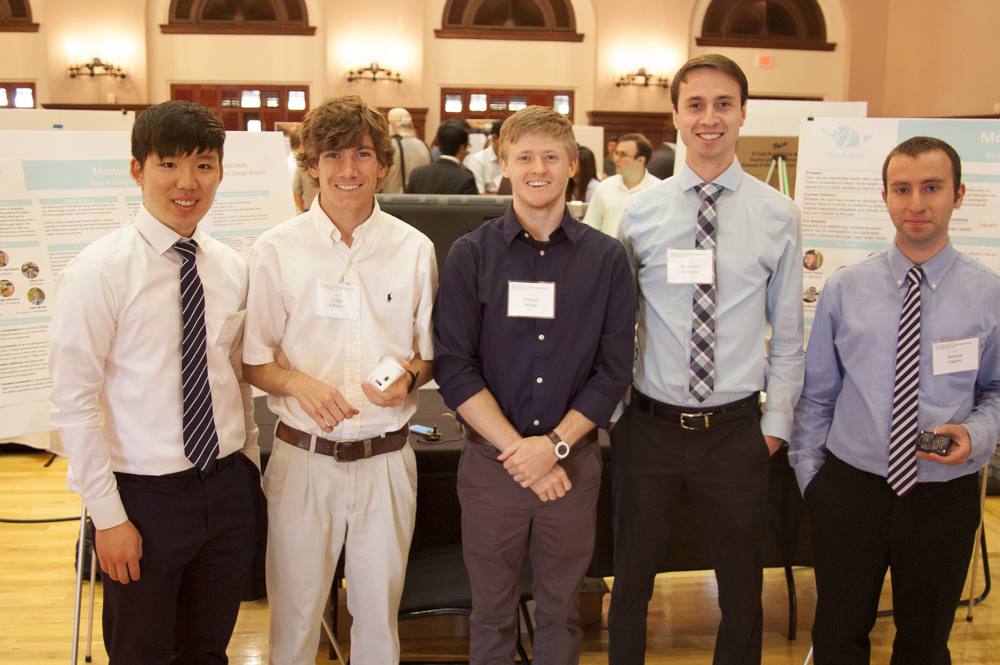

# Modulaid

### Background
ModulAid was born at UT Austin as a Senior Design Project for 5 Electrical Engineering students. Their senior design class was a special section called "Senior Design Startup" and the students thought up their own project rather than doing an industry sponsored project.

ModulAid extends a smartphone by providing an easy to use interface for nearly any type of sensor. The team made one port which supports I^2C, UART, SPI, and any analog sensors (through an ACD which talks to the uProcessor through SPI). 

The team chose to focus on making ModulAid a system medical device.

The ModulAid app was designed to make access to health information very cheap. The team wanted to make it as easy as possible for people to get insights about their own health and the health in their communities. 

ModulAid makes insights about one’s community health possible by using FireBase to anonymously store health data with a location. One way to view community health data is to plot the location and severity of fever on a map. 

The team ModulAid’s app heatmap which shows each user’s last temperature measurement on an Apple map.

Screenshot's of the iOS app

### Going Forward
Due to the project’s scope in the Senior Design class, ModulAid only supports two sensors, a thermometer, and a heart rate monitor. 

### Resources
ModulAid draws from several projects and frameworks:

NXP QuickJack: http://www.nxp.com/products/microcontrollers-and-processors/arm-processors/lpc-cortex-m-mcus/lpc-cortex-m0-plus-m0-mcus/lpc800-low-cost-cortex-m0-plus-mcus/om13069-smartphone-quick-jack-solution:OM13069

LFHeatMap: https://github.com/gpolak/LFHeatMap

Firebase: https://www.firebase.com/

### Contributors 
Alex Lee, Cage Johnson, Sam Moser, Alejandro Silveyra, and Ammar Hazim (in order of appearance)    
Photo of team at UT Austin Electrical and Computer Engineering Senior Design Open House - Spring 2016

